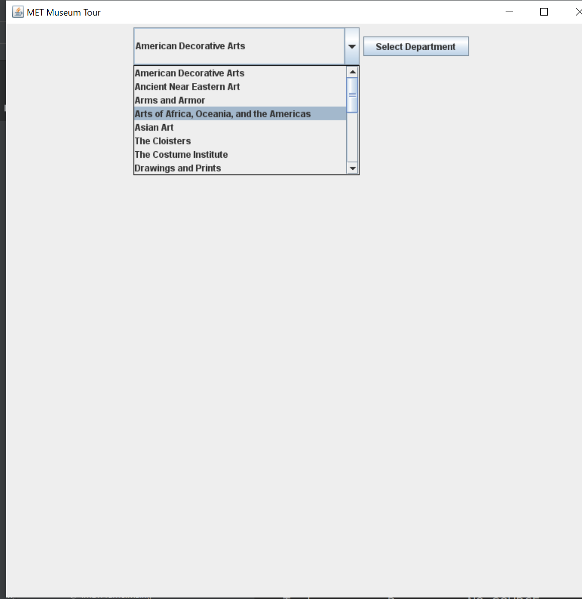
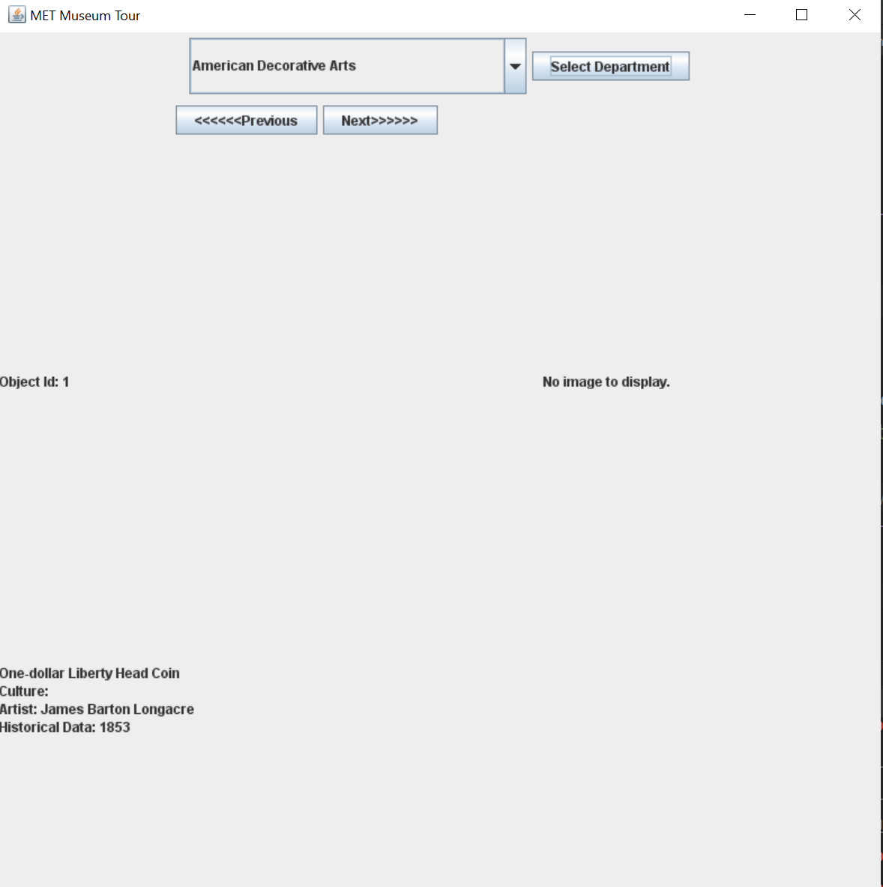

#View Artifacts at the Metropolitan Museum Of Art

This application allows you to select from 
the museum departments and view different artifacts
(when there is a image, that is).

This application uses [MET's API](https://metmuseum.github.io/), 
that gives access to the museum's departments
and artifacts.
This application uses [Retrofit](https://square.github.io/retrofit/) to access the API.

 Browse museum departments.

View artifacts in a department.

Download [executable jar file](https://github.com/rachel613g/metmuseumvirtualtour/tree/master/build/libs "Executable jar file").
